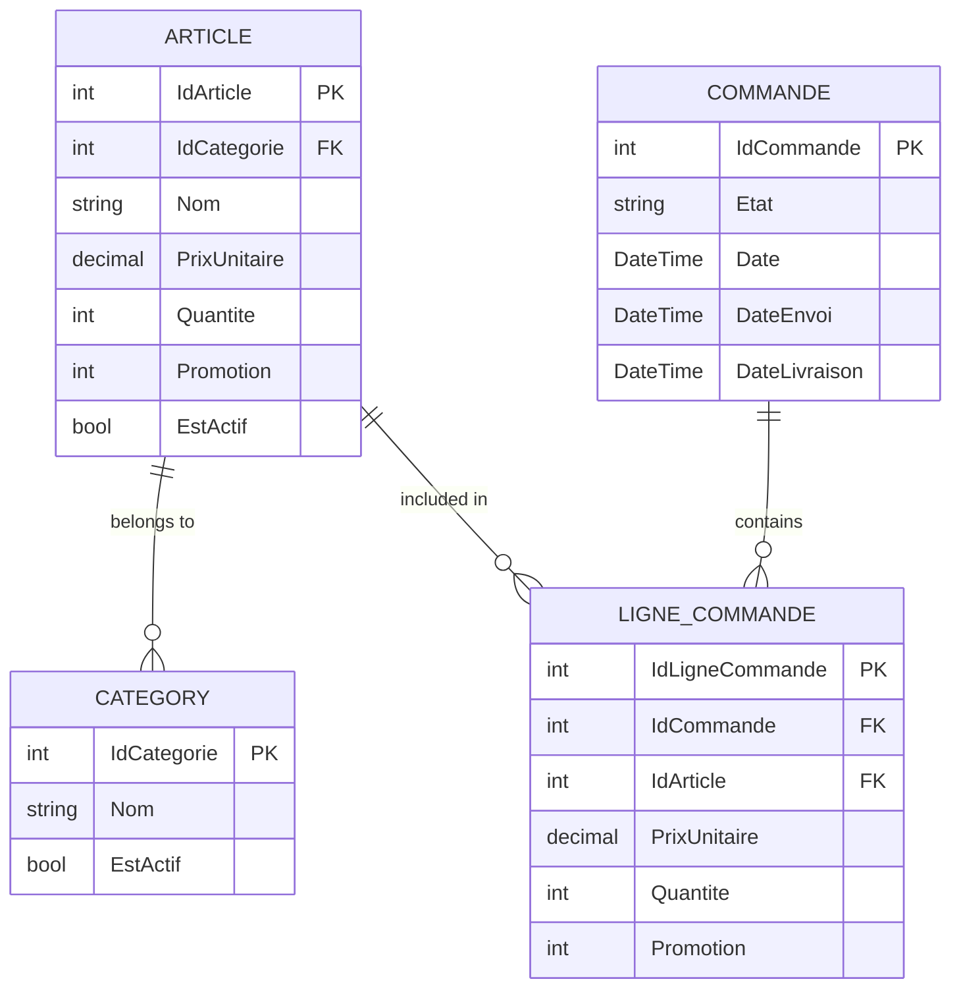

# CS_Winform_ESIEE

Le projet consiste à développer une application de gestion de magasin en C# avec une interface graphique WinForms.
L'application permettra de gérer les articles, les paniers, les commandes et les promotions, tout en utilisant des
fonctionnalités avancées comme LINQ, la sérialisation JSON et les expressions lambda.

## Schema de la base de données

