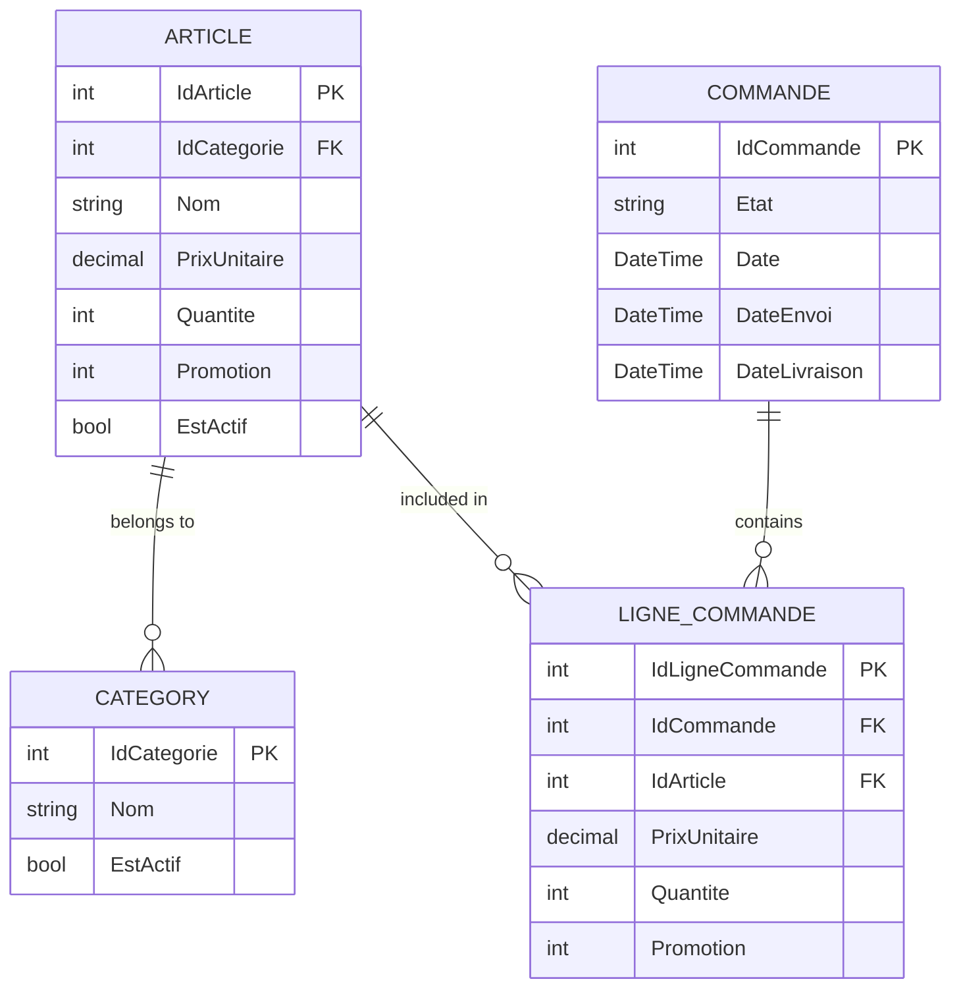

# CS_Winform_ESIEE

## Sommaire

<!-- TOC -->
* [CS_Winform_ESIEE](#cs_winform_esiee)
  * [Sommaire](#sommaire)
  * [Introduction](#introduction)
  * [Installation](#installation)
    * [Prérequis](#prérequis)
    * [Instructions](#instructions)
  * [Utilisation](#utilisation)
    * [Exemple d'utilisation](#exemple-dutilisation)
    * [Captures d'écran](#captures-décran)
  * [Fonctionnalités](#fonctionnalités)
  * [Schéma de la base de données](#schéma-de-la-base-de-données)
  * [Licence](#licence)
<!-- TOC -->

## Introduction

Le projet consiste à développer une application de gestion de magasin en C# avec une interface graphique WinForms.
L'application permettra de gérer les articles, les paniers, les commandes et les promotions, tout en utilisant des
fonctionnalités avancées comme LINQ, la sérialisation JSON et les expressions lambda.

Ce projet a été développé dans le cadre d'un cours à l'ESIEE. Il vise à fournir une solution complète pour la gestion
d'un magasin, incluant la gestion des articles, des commandes et des promotions.

## Installation

### Prérequis

- .NET Framework 4.8 ou supérieur
- Visual Studio ou JetBrains Rider

### Instructions

1. Clonez le dépôt :
   ```bash
   git clone https://github.com/Redstoneur/CS_Winform_ESIEE.git
   ```
2. Ouvrez le projet dans votre IDE préféré (Visual Studio ou JetBrains Rider).
3. Restaurez les packages NuGet :
   ```bash
   dotnet restore
   ```
4. Compilez et exécutez le projet.

## Utilisation

### Exemple d'utilisation

1. Lancez l'application.
2. Ajoutez des articles au panier.
3. Passez une commande.
4. Gérez les promotions.

### Captures d'écran

[//]: # (![Capture d'écran 1]&#40;path/to/screenshot1.png&#41;)

[//]: # (![Capture d'écran 2]&#40;path/to/screenshot2.png&#41;)

> En cours de développement...

## Fonctionnalités

- Gestion des articles
- Gestion des commandes
- Gestion des promotions
- Utilisation de LINQ pour les requêtes
- Sérialisation JSON pour la sauvegarde des données
- Expressions lambda pour les opérations sur les collections

## Schéma de la base de données



Voir le fichier [Create-DataBase.sql](Create-DataBase.sql) pour le script de création de la base de données.

## Licence

Ce projet est sous licence MIT. Voir le fichier [LICENSE](LICENSE) pour plus de détails.
